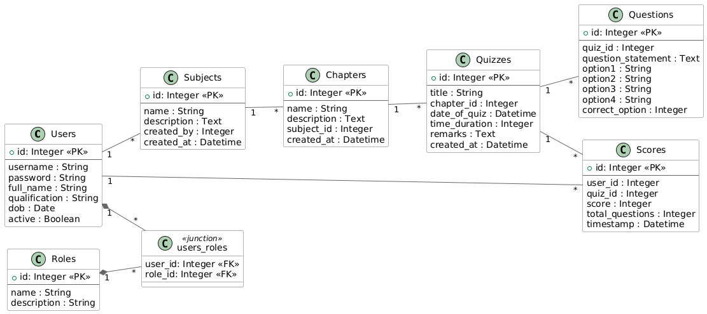

## Schema

      
    The schema is genereated using <a href="https://en.wikipedia.org/wiki/PlantUML">PlantUml</a>

- You can install the [PlantUML VsCode extension](https://marketplace.visualstudio.com/items?itemName=jebbs.plantuml) to view `.puml` files in VSCode
- Or you can use an online `.puml` viewer :- https://www.planttext.com/

    

